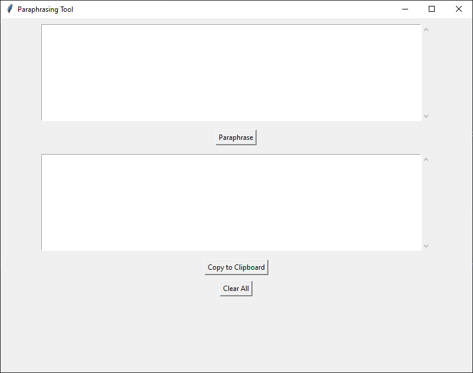
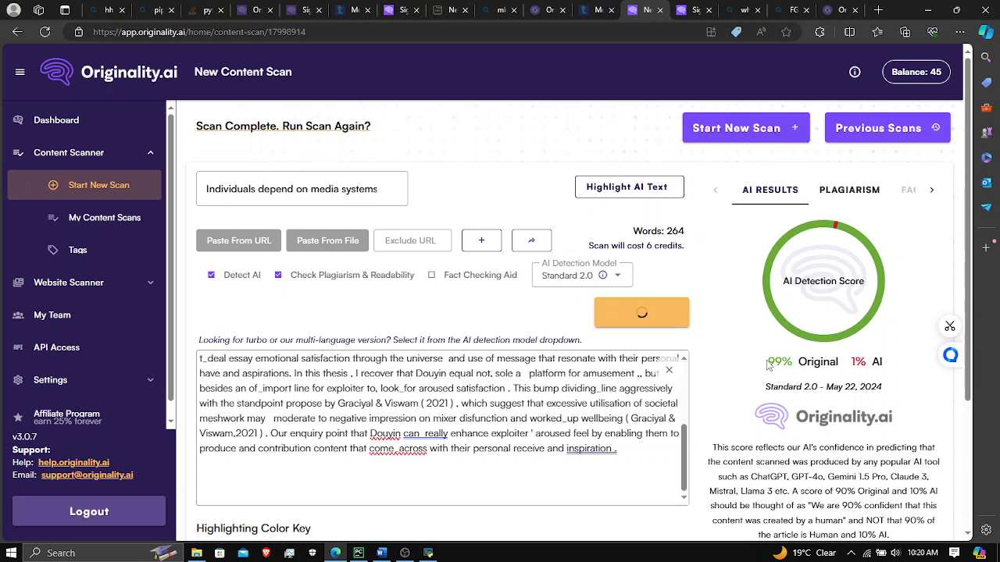

# Paraphrasing Tool

This Paraphrasing Tool is a Python application that allows users to paraphrase text using a simple graphical user interface (GUI). The tool replaces approximately 60% of the words in the input text with their synonyms while introducing human-like errors to make the paraphrased text appear more natural. The GUI is built using Tkinter, and the text processing relies on the Natural Language Toolkit (nltk).

## Features

- Replaces 60% of the words in the input text with synonyms.
- Avoids replacing common stop words (e.g., "the", "an", "and").
- Introduces human-like errors such as double spaces and typos.
- Simple and intuitive GUI for input and output.
- Includes functionality to copy the paraphrased text to the clipboard.
- Clear all text areas with a single button.

## Requirements

- Python 3.x
- Tkinter (for GUI)
- NLTK (Natural Language Toolkit)

## Installation

1. Install Python 3 from the [official website](https://www.python.org/).

2. Install the required libraries:
    ```bash
    pip install nltk tkinter
    ```

3. Download the NLTK data:
    ```python
    import nltk
    nltk.download('punkt')
    nltk.download('averaged_perceptron_tagger')
    nltk.download('wordnet')
    nltk.download('stopwords')
    ```

## Usage

1. Clone this repository:
    ```bash
    git clone https://github.com/yourusername/paraphrasing-tool.git
    cd paraphrasing-tool
    ```

2. Run the `paraphrasing_tool.py` script:
    ```bash
    python paraphrasing_tool.py
    ```

3. Enter the text you want to paraphrase in the input text area.
4. Click the "Paraphrase" button to generate the paraphrased text.
5. The paraphrased text will appear in the output text area.
6. Use the "Copy to Clipboard" button to copy the paraphrased text.
7. Use the "Clear All" button to clear both input and output text areas.

## Screenshots

### Main Interface


### Paraphrased Output


## Code Overview

The main code consists of the following key components:

1. **Synonym Retrieval**: Retrieves simple synonyms for words using NLTK's WordNet.
2. **Human-like Errors**: Introduces human-like errors to the paraphrased text.
3. **Paraphrasing Function**: Replaces approximately 60% of the words in the input text with synonyms.
4. **GUI Components**: Implements a Tkinter-based GUI for user interaction.

### Synonym Retrieval
```python
def get_synonyms(word):
    synonyms = set()
    for syn in wordnet.synsets(word):
        for lemma in syn.lemmas():
            synonym = lemma.name().replace('_', ' ')
            if synonym.isalpha() and len(synonym.split()) == 1 and len(synonym) <= 10:  # Filter out complex synonyms
                synonyms.add(synonym)
    return synonyms
